# GitOps Enhanced Plugin

An OpenShift Console dynamic plugin that brings full Argo CD and Argo Rollouts management directly into the OpenShift web console. Browse applications, inspect resource trees, trigger syncs, manage rollouts, and monitor GitOps health — all without leaving the console.

[](LICENSE)


> **New: Promotion Pipelines** — Automated environment promotion (dev → staging → prod) with GitOps Promoter + Tekton integration. [Setup & Usage Guide →](docs/promotion-usage.md)

## Screenshots

| Dashboard | Applications |
|:-:|:-:|
| 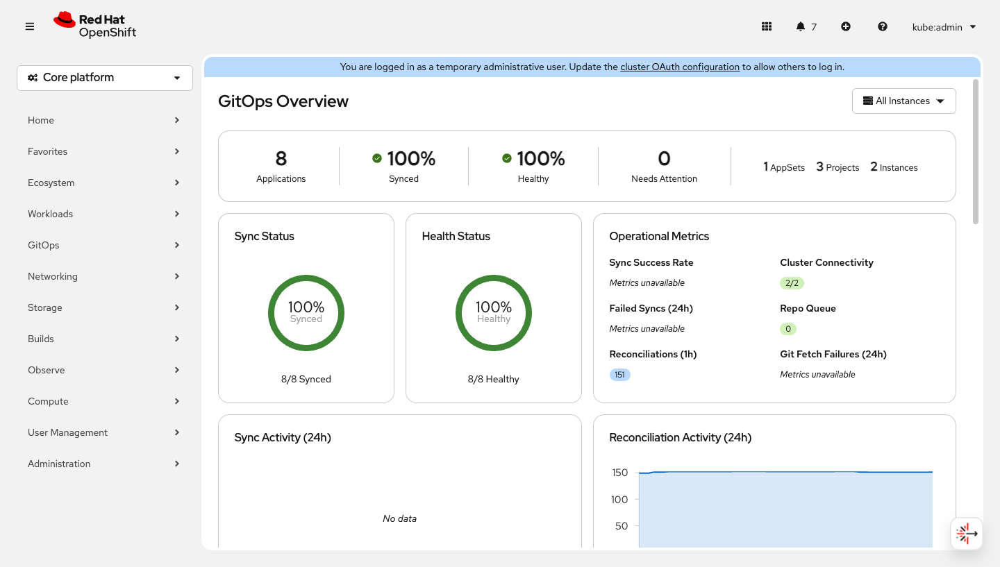 | 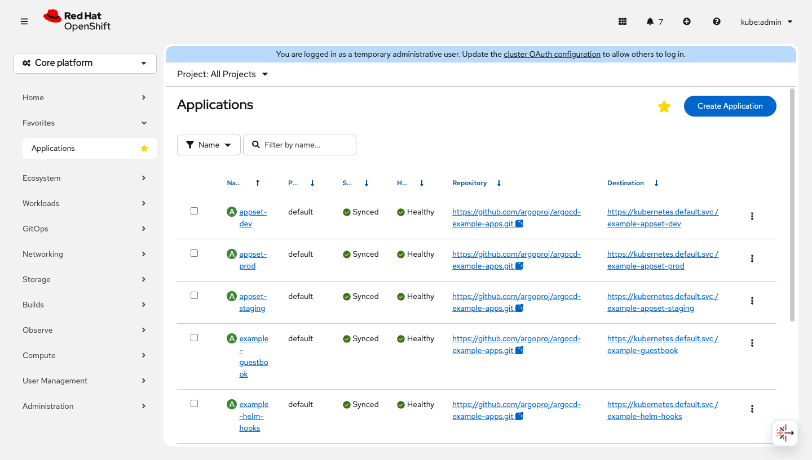 |

| Resource Tree | Application Detail |
|:-:|:-:|
| 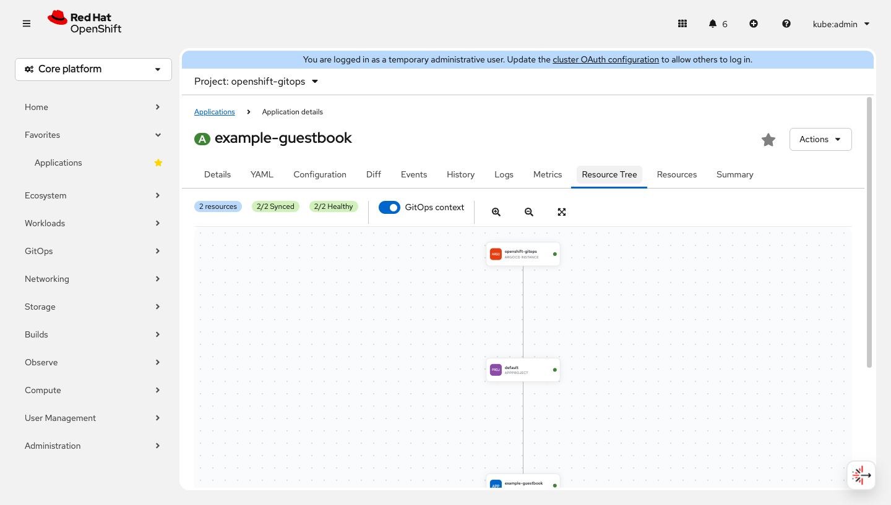 | 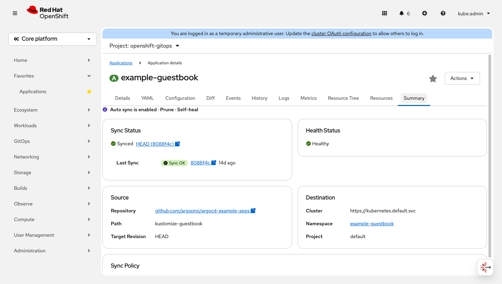 |

| Rollouts | ArgoCD Instances |
|:-:|:-:|
| 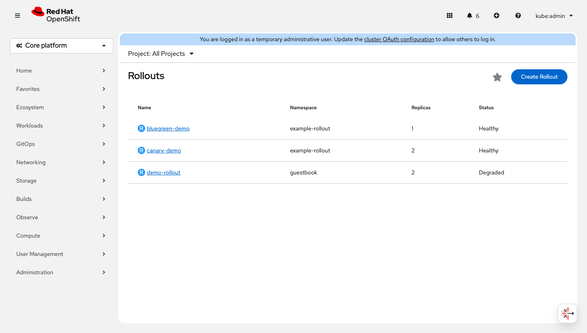 | 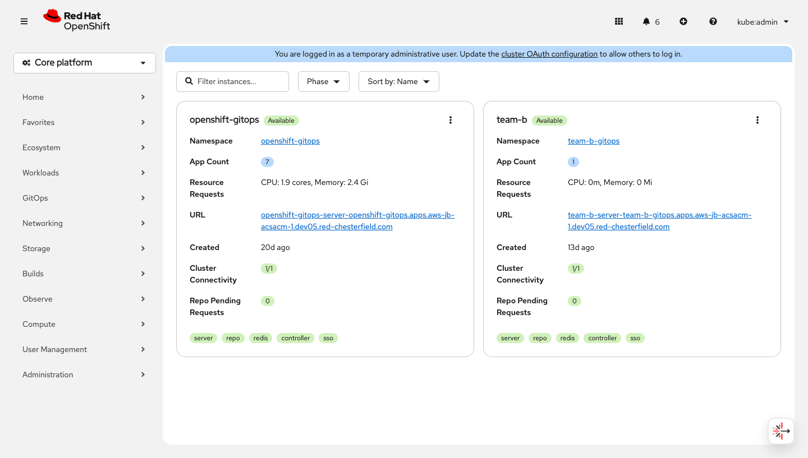 |

| Promotion Pipeline | Promotion List |
|:-:|:-:|
| 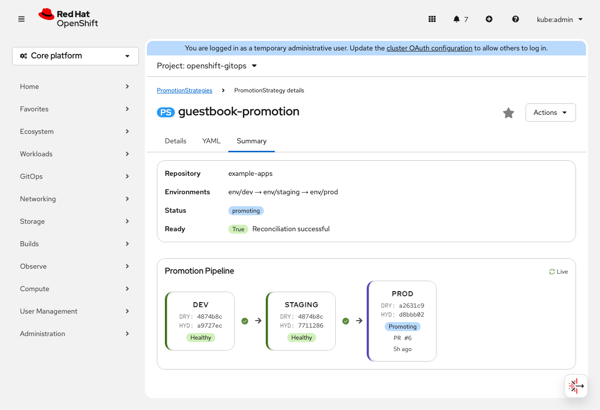 | 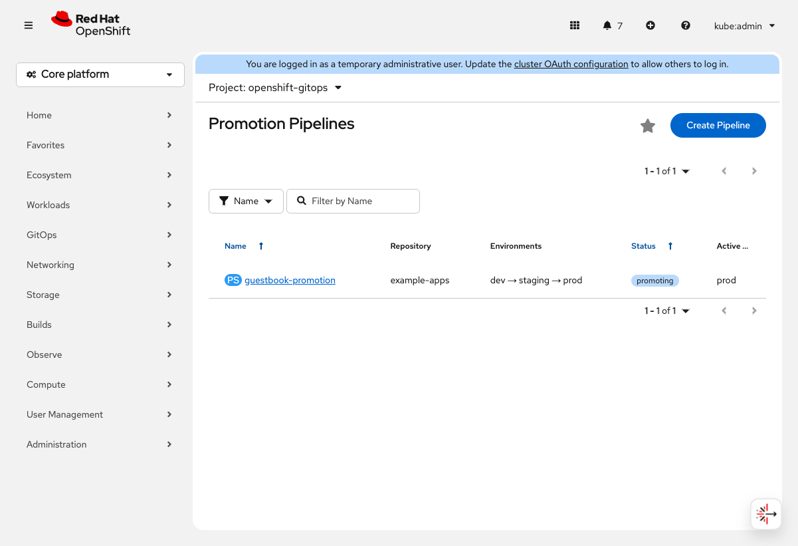 |

| Create Pipeline Wizard | App Promotion Tab |
|:-:|:-:|
| 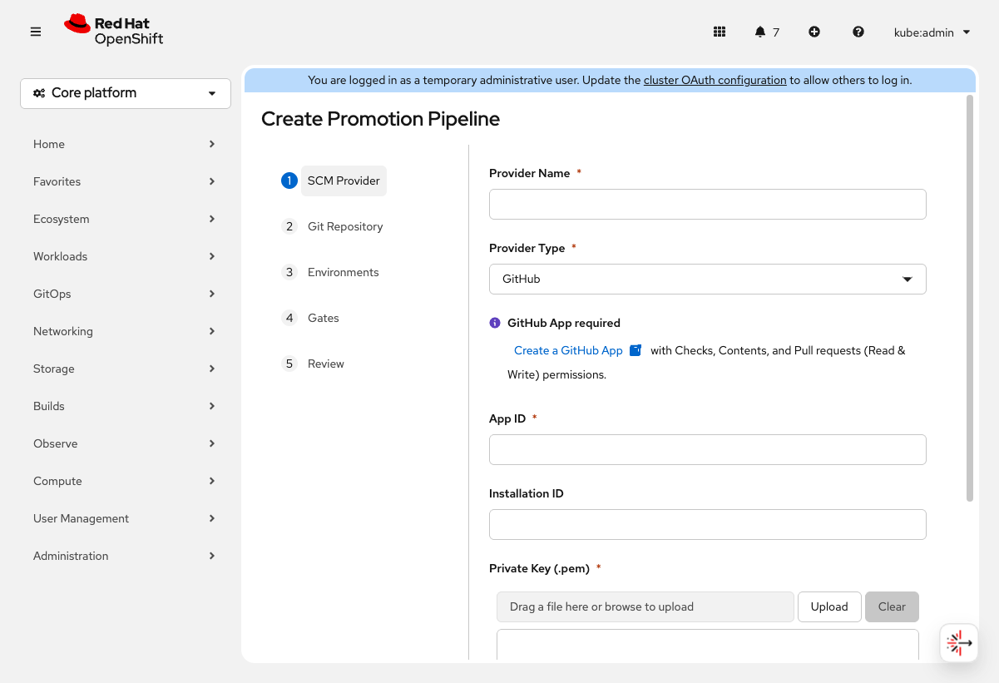 | 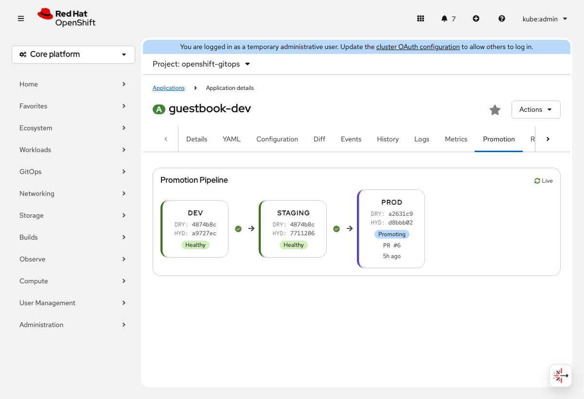 |

| Promotion Banner |
|:-:|
| 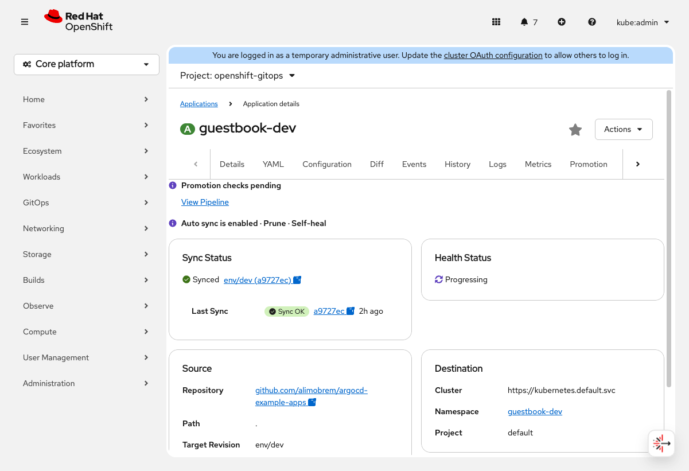 |

## Features

### Dashboard
- Fleet-wide sync and health status with donut charts
- Prometheus-powered operational metrics (sync success rate, failed syncs, reconciliations, cluster connectivity, repo queue, git fetch failures)
- Sync and reconciliation activity sparklines (24h)
- Needs-attention table highlighting degraded, out-of-sync, and errored applications
- Infrastructure overview (operator version, ArgoCD instances, rollout managers)

### Application Management
- Full CRUD for Applications, ApplicationSets, and AppProjects
- **Sync** with options: dry run, prune, force, apply-only, selective resources
- **Refresh**, **Terminate**, **Retry**, and **Delete** actions
- Multi-source application support
- Sync policy toggles (auto-sync, prune, self-heal)
- Deployment history with rollback support
- Conditions banner and connection status indicators

### Resource Tree
- Interactive topology visualization using PatternFly react-topology
- Hierarchical resource tree from the Argo CD API (with flat fallback)
- Kind-specific icon nodes with health status dots
- GitOps context toggle (shows ArgoCD instance and AppProject ancestry)
- Focus issues mode to highlight degraded paths
- Click-to-navigate to any managed resource
- Resource detail drawer

### Rollouts (Argo Rollouts)
- Canary and blue-green strategy visualization
- Step-by-step rollout progress with pause/promote/abort controls
- Full rollout editing: replicas, strategy, services, steps, containers
- Analysis runs and experiments tabs
- Pod status overview

### AppProjects
- RBAC policy viewer and access tester
- Destination and source repo restrictions
- Sync windows with active/inactive status
- Role management

### Prometheus Metrics
- Application-level metrics tab (sync totals, success rate, reconciliation count, resource health)
- Dashboard-level fleet metrics (9 Prometheus queries)
- Namespace-scoped queries for multi-instance support

### Multi-Instance Support
- Manage multiple ArgoCD instances from a single console
- Instance picker across all views
- Per-instance namespace scoping for watches and metrics
- ArgoCD instance list page with component status, version info, and routes

### Promotion Pipelines (GitOps Promoter + Tekton)
- Horizontal pipeline visualization showing commits flowing through dev → staging → prod
- Click any environment stage to see active/proposed commits, hydrator metadata, promotion history, and related applications
- Click any gate to see commit status checks with approve/retry actions
- Stuck detection warns when checks have been pending too long
- Toast notifications on gate state changes
- Dashboard integration with pipeline count, blocked count, and active promotions table
- Application detail banner showing promotion status with link to pipeline view
- Full setup wizard: SCM Provider → Git Repository → Environments → Gates → Review
- Supports GitHub, GitLab, Gitea, Forgejo, Bitbucket Cloud, and Azure DevOps
- See [Promotion Pipeline Usage Guide](docs/promotion-usage.md) for detailed setup and usage

### Additional Features
- Namespace GitOps tab (see apps deployed to any namespace)
- Settings page with repository and cluster management
- Full i18n support
- 60+ console extensions (8 nav items, 9 pages, 28 tabs, 2 action providers, 6 flags)

## Prerequisites

- **OpenShift** 4.16 or later
- **Red Hat OpenShift GitOps** operator (or standalone Argo CD)
- **Argo Rollouts** (optional, for rollout management features)
- **GitOps Promoter** (optional, for promotion pipeline features) — [v0.27+](https://github.com/argoproj-labs/gitops-promoter)
- **OpenShift Pipelines / Tekton** (optional, for CI gate checks)
- **Prometheus** (optional, for metrics dashboard and application metrics)

## Installation

### Build and deploy on-cluster

```bash
# Clone the repo
git clone https://github.com/alimobrem/gitops-enhanced-plugin.git
cd gitops-enhanced-plugin

# Create the namespace and build config
oc new-project gitops-enhanced-plugin
oc new-build --binary --name=gitops-enhanced-plugin -n gitops-enhanced-plugin

# Build the image on-cluster
oc start-build gitops-enhanced-plugin --from-dir=. --follow -n gitops-enhanced-plugin

# Deploy with Helm
helm upgrade -i gitops-enhanced charts/gitops-enhanced-plugin/ \
  --set plugin.image=image-registry.openshift-image-registry.svc:5000/gitops-enhanced-plugin/gitops-enhanced-plugin:latest \
  -n gitops-enhanced-plugin

# Enable the plugin
oc patch consoles.operator.openshift.io cluster --type merge \
  -p '{"spec":{"plugins":["gitops-enhanced"]}}'
```

### Multi-instance ArgoCD

To proxy multiple ArgoCD instances, add entries to `values.yaml`:

```yaml
argocd:
  instances:
    - alias: argocd
      namespace: openshift-gitops
      serviceName: openshift-gitops-server
      port: 443
    - alias: team-a
      namespace: team-a-gitops
      serviceName: argocd-server
      port: 443
```

## Architecture

```
OpenShift Console
  |
  +-- GitOps Enhanced Plugin (React 17 / PatternFly 6)
        |
        +-- K8s API (via console SDK)
        |     Watch: Applications, ApplicationSets, AppProjects, Rollouts, ArgoCD CRs
        |     Patch: sync policy toggles, YAML edits
        |
        +-- Argo CD API (via ConsolePlugin proxy)
        |     Resource trees, managed resources, diffs
        |
        +-- Prometheus (via console SDK usePrometheusPoll)
              Sync metrics, reconciliation counts, cluster health
```

- **Console SDK** (`@openshift-console/dynamic-plugin-sdk`) provides K8s watches, resource links, Prometheus polling, and route integration
- **ConsolePlugin proxy** forwards authenticated requests to the Argo CD server API for resource tree and diff data
- **PatternFly 6** components are shared from the console runtime (not bundled) to avoid version conflicts
- **react-topology** powers the resource tree visualization

## Development

### Quick start

```bash
npm install        # install dependencies
npm test           # run 551 tests across 99 suites
npm run build      # production webpack build
```

### Project structure

```
src/
  components/       # React components organized by feature
    ApplicationDetail/   # App detail tabs (Overview, Resources, Tree, History, etc.)
    Dashboard/           # GitOps dashboard with charts and metrics
    Rollout/             # Rollout visualization, pods, analysis
    Settings/            # Repository and cluster management
    shared/              # Reusable components (ConfirmModal, StatusIcons, etc.)
  hooks/             # K8s watch hooks, action hooks, instance management
  models/            # CRD model definitions (GroupVersionKind)
  services/          # Argo CD API service layer
  types/             # TypeScript interfaces
  utils/             # Shared utilities (status colors, URL builders, Prometheus parsers)
charts/              # Helm chart with ConsolePlugin CR and proxy config
locales/             # i18n translation files
```

### Key patterns

- Every page component is wrapped with `InstanceProvider` for multi-instance support
- Use `useCurrentInstance()` to get the selected ArgoCD instance — never hardcode `openshift-gitops`
- Use `getApplicationSource(app)` from `utils/application` — never inline `app.spec.source ?? app.spec.sources?.[0]`
- All destructive actions require `ConfirmModal`
- All TSX files must `import React from 'react'` (classic JSX runtime for React 17)

### Testing

```bash
npm test                          # run all tests
npm test -- --watch               # watch mode
npm test -- --testPathPattern=tree # run specific tests
```

Tests mock `@openshift-console/dynamic-plugin-sdk` and `react-i18next`. Each component has a `.test.tsx` file covering loading, loaded, and error states.

### Deploy changes

```bash
make ship    # build image on-cluster, helm deploy, rollout restart
```

## License

[Apache License 2.0](LICENSE)
